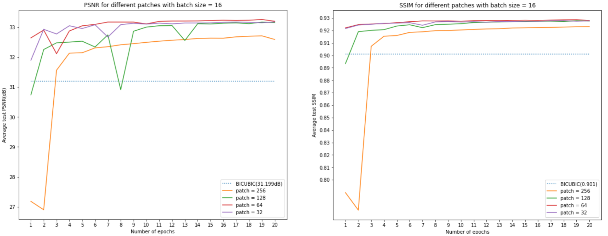
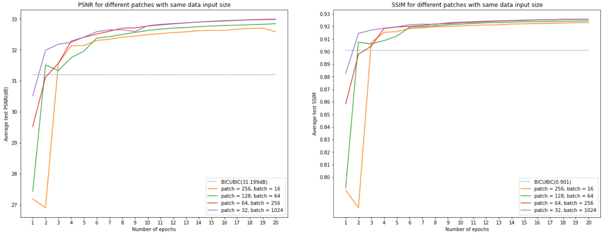
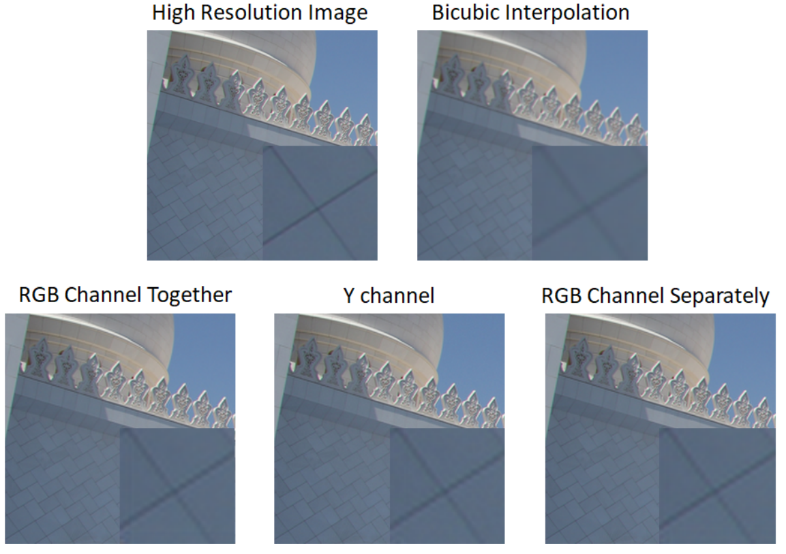

### Image Super Resolution

This project was done by Jingxiang Zhang and Lujia Zhong. It is the final project of EE 541, USC.

#### Abstract:

**Purpose:** This is a super-resolution (SR) project. We propose to recover high-resolution images
from low-resolution images, using the dataset of DIV2K. Image super-resolution is a critical step
to recover and even enhance the information transmitted by the image. It has many important
applications in other fields, such as satellite image remote sensing, and digital high-definition.
There are many computer vision solutions to this problem, including interpolation-based methods,
reconstruction-based methods, and learning-based methods.

We will first test various SR models to enhance the quality of given images that are common in
the natural environment, using Peak signal to noise ratio (PSNR) and structural index similarity
(SSIM) as criteria for model performance, and compare the deep learning models with Bicubic and
other interpolation algorithms. Finally, we will test our best model on the whole training set and
analyze the result.

In the extension work, we will compare how the patch (sub-image) size and batch influence the
training process. Then we design an experiment to show that training Y channel only is reasonable
and generally better than training RGB channels together. At last, we will compare how the upscale
factor influences the pre-upsampling model.

**Model:** SRCNN, FSRCNN, ESPCN, VDSR, SRGAN, EDSR, DCSCN, SUBCNN, Per. SRGAN

click [here](EE541-final project report.pdf) to view the whole paper.

#### Introduction of this folder:

This folder have all the code for the extension part of this project. Created by Jingxiang Zhang. Most of the code file is .ipynb format to make the debug easier. I will explain how each file work. Mind that some of the files below are not in use in the extension part.

**Utility files:**

- criteria.py: This file have PSNR and SSIM function.

- data_loader.py: This file create validation set data loader and training set data loader.
- plot.py: Show the comparison of two images - Not in use in the extension part.
- prepare_data.py: Crop and make training dataset - Not in use in the extension part.

**Model files:**

- DCSCN_model.py: DCSCN module, include DCSCN model, train DCSCN function, test DCSCN on validation set function, test one given image function - Not in use in the extension part.
- ESPCN_model.py: ESPCN module, include ESPCN model, train ESPCN function, test ESPCN on validation set function, test one given image function.
- SRCNN_model.py: SRCNN module, include SRCNN model, train SRCNN function, test SRCNN on validation set function, test one given image function.

**Main files:**

All the files in this part is .ipynb format, and it has sufficient comment to explain how each function work.

- prepare_data.ipynb: This file have all the code that I used to create training dataset, include create the dataset for extension 1, 2, and 3.

- DCSCN.ipynb: The main function of training the DCSCN model - Not in use in the extension part.
- ESPCN.ipynb: The main function of training the ESPCN model - Not in use in the extension part.
- RSCNN.ipynb: The main function of training the RSCNN model - Not in use in the extension part.
- test_patches_size.ipynb: For extension 1, compare the training process of different patch size.
- test_channel.ipynb: For extension 2, compare training Y channel with RGB channel.
- test_scale.ipynb: For extension 3, test how upsampling scale factor influence the model.

**Model files:**

In the extension part, all the models I used is small and simple, all of them together are no more than 1.3MB. 

- other_models
  - ESPCN.model - Not in use in the extension part.
  - RSCNN.model - Not in use in the extension part.

- test_patch_size: Used in the extension 1.
  - ESPCN_patch32_64_batch16.model: training by patch = 32 for low resolution (LR) input, and patch = 64 for high resolution (HR) label, and batch size = 16.
  - ESPCN_patch64_128_batch16.model: training by patch = 64 for LR, patch = 128 for HR, and batch size = 16.
  - ESPCN_patch128_256_batch16.model: training by patch = 128 for LR, patch = 256 for HR, and batch size = 16.
  - ESPCN_patch256_512_batch16.model: training by patch = 256 for LR, patch = 512 for HR, and batch size = 16.
  - ESPCN_patch32_64_batch1024.model: training by patch = 32 for LR, patch = 64 for HR, and batch size =  1024.
  - ESPCN_patch64_128_batch256.model: training by patch = 64 for LR, patch = 128 for HR, and batch size = 256.
  - ESPCN_patch128_256_batch64.model: training by patch = 128 for LR, patch = 256 for HR, and batch size = 64.
- test_channels: Used in the extension 2.
  - ESPCN_patch64_128_Ychannel_compare_BGR.model: training on Y channel only.
  - ESPCN_BGR_channel.model: training on RGB channels together.
  - ESPCN_R_channel.model, ESPCN_G_channel.model, and ESPCN_B_channel.model: training on R, G, and B channels separately.

- test_scale_factor: Used in the extension 3.
  - SRCNN_X2.model: down sample and up sample by factor of 2 as training set.
  - SRCNN_X3.model: down sample and up sample by factor of 3 as training set.
  - SRCNN_X4.model: down sample and up sample by factor of 4 as training set.
  - SRCNN_X5.model: down sample and up sample by factor of 5 as training set.

#### extension part of this project:

In this project, I mainly worked on the introduction part and the extension part. Therefore, I will make a brief introduction of what I find. Here, I have 3 more questions about the super resolution.

1. How does patch size (sub-image) influence the training?
2. How does the channel influence the training?
3. How does the scale factor influence the pre-upscaling model?

##### 1. Patches Size

In most of the super-resolution network models, the default image pre-processing method is to cut the training image into small patches and train the network by those small patches. Dong et al. proposed using 33\*33 as a sub-image size with a stride equal to 14. Also in [8], Zhou, et al. show that the smaller the stride, the smaller the MSE, and they use a patch size range from 3\*3 to 13\*13. In our previous experiment, we use a patch size equal to 50. These default settings aroused our curiosity, does the sub-image patch size 	influence the training process? Hence we design these experiments to compare the training process given different patch sizes.

We will use the ESPCN model since it is a relatively simple model, using MSE loss as a loss
function. Training the model by Adam optimizer with learning rate decay by 0.9 for each epoch,
and start with 0.01. The batch size of training is 16. We cut the training images into 32\*32,
64\*64, 128\*128, and 256\*256 with no overlapping and padding with 0 in the image border (instead
of dropping it). Also, we convert the RGB channel into the YCbCr channel and only train and
compare the performance on the Y channel as with previous settings. Here, I will train the model
for 20 epochs. 20 epochs may not converge completely, and may not reach the best performance
yet, but our goal is only to make comparison between the training process.

Next figure shows that when the patch size is equal to 64, the model will get the best performance.
A patch size equal to 32 is also a good choice, but the smaller the patch size, the longer it will take
to train. When the patch size is larger than 64, the larger the patch size, the worse the performance
is.

{:data-align="center"}

However, one should notice that for a smaller patch size, it has more iterations for each epoch, i.e., the data input into the model at each iteration is different. The smaller patch size has the advantage that it can train more iterations for each epoch. To make sure that the data size input into the model has the same size, we design another group of training. For patch sizes equal to 32, 64, 128, and 256, we use the batch size = 1024, 256, 64, 16. This time, the input data have the same size, and the iteration for each epoch are close to each other (because we pad the image when cutting, the larger the sub-image, the larger blank will be padding, therefore the iteration here will not equal).

{:data-align="center"}

The figure above shows that even if we keep the same input data size, a patch size equal to 32 or 64 still gets the best performance, and also, the larger the patch size, the worse the performance. The table below shows the final test performance on the validation set.

{:data-align="center"}

Conclusion for this part: Table 3 shows that, when batch size equals 16, and patch size equals 64, the model will get the best performance. However, one should notice that it will spend more time to train more iterations. The training time between all these batch sizes and patch size settings maybe varies model by model. Given the same training time id = 2 spend, id = 6 can train more epochs, and performance may finally exceed id = 2.

##### 2. Training Channel

In almost all the super-resolution research, the original image will convert into a YCbCr channel, and only the Y channel will be used to train the model. In YCbCr color space, Y refers to the luminance component, Cb refers to the blue chroma component, and Cr refers to the red chroma component. Since human vision is more sensitive to brightness changes than to chromatic changes. In this part, we will try to validate that training the Y channel only is reasonable.

We will still use the ESPCN model in this part, using MSE loss as the loss function. Training the model by Adam optimizer with learning rate decay by 0.9 for each epoch, and start with 0.01. The batch size of training is 64, and the patch (sub-image) size is 64\*64. We will train the model for 20 epochs, and record PSNR for each epoch, SSIM will not be used.

For the first model, we will train the Y channel only. First, we read the low-resolution image as LR and convert the image to YCbCr, extracting Y channel as LR Y. Then we make Bicubic interpolation on LR and get LR After, convert LR After to YCbCr, extract Cb and Cr channel as LR After Cb and LR After Cr. We put LR Y as ESPCN model input, and get LR After Y. Finally, concatenate LR After Y, LR After Cb, and LR After Cr together, and convert back to LR After RGB. Then we read the high-resolution image as HR RGB and convert the image to YCbCr, extracting the Y channel as HR Y. We will calculate the PSNR of LR Y and HR Y as the first pair, and LR After RGB and HR RGB as the second pair. In our expectation, the PSNR of the first pair will be higher than the second pair, since this model is trained on the Y channel. But the PSNR of LR After RGB and HR RGB will not be too low, because the Y channel is the denominate channel.

For the second model, we will train the RGB channel together, the input channel of the model is 3, and the output is also 3. PSNR is calculated by RGB channels together.

For the third model, we will train the R, G, and B channel separately, each model train only one channel, and calculate PSNR on its own channel. Finally, we take the average PSNR as the model performance.

{:data-align="center"}

However, the real RGB channel PSNR should be calculated in the next formula. But the arithmetic mean and the geometric mean of MSER + MSEG + MSEB are very close in this case. We use the previous formula as PSNR performance.

{:data-align="center"}

{:data-align="center"}

The figure above shows the training curve for the ESPCN model using different training channels. Y channel stands for the model training on the Y channel, and the PSNR is for Y channel compar- ison, while Y channel BGR stands for the model training on the Y channel, and the PSNR is for RGB channel comparison (here we use BGR because OpenCV read the image by BGR channel). BGR channel stand for the model training on RGB channel together, and B G R Ave stand for the average PSNR for 3 models training on R, G, and B channel separately.

From this figure, we can find that the worst model is training on the BGR channel together. While training on B, G, and R separately is only slightly better than training on the Y channel only (compare to the PSNR on the BGR channel). Given enough epochs, they may finally reach the same performance. However, training three models will spend more time. Therefore, training the Y channel only is very reasonable.

{:data-align="center"}

The figure above show the performance on the test image. All the models are better than the Bicubic one. According to this figure, it is difficult to tell the difference between these three models. However, one can spot that all three images below have ripples around the black line. Since ESPCN uses a convolutional layer, like many filters, the black color in the black line will influence the surrounding area, that’s why there are ripples around the black line.

##### 3. Upscale Factor

In the Pre-upsampling SR algorithm, the algorithm will first upsample the image by Bicubic interpolation, then input the image into the model. Our training image is a low-resolution image, and the label is a high-resolution image. The model itself is to find a map between the low-resolution image and the high resolution image. So, we wonder, if the input training image is a very low-resolution image, then the model must be more capable to restore a low-resolution image to a high-resolution image.

Hence, we design this part to verify our thought. For all the training images, we downsample the image by a factor of n and then upsample the image by a factor of n, and the new image will be used as a low-resolution training image. This dataset is marked as Data Xn. In this part, we will use the 2, 3, 4, and 5 as scale factors, then we have Data X2, Data X3, Data X4, and Data X5 datasets. Use SRCNN as a model, the training hyper-parameter is the same as the previous settings. Therefore, we will train 4 models by these 4 datasets, and name them SRCNN X2, SRCNN X3, SRCNN X4, SRCNN X5.

Dong et al. compare the PSNR and SSIM pair by pair, which means, use SRCNN X2 to test the performance Data X2, use SRCNN X3 test the performance Data X3, and so forth. In our expectation, SRCNN X5 has the best capability of restoring the image, then it should outperform SRCNN X2 even in Data X2. Hence, we will use each model to test each dataset, which will be 4 × 4 = 16 PSNR and SSIM results, and find out which model is the best for each dataset.

The other application of this part is that suppose we have an SRCNN X2 pre-upsampling model, and we want to upscale an image by 3 times, can we use this model? Or shall we need to train a new SRCNN X3 model? If the SRCNN X2 model performs approximately equal to SRCNN X3 on Data X3, then we don’t need to train a new one.

{:data-align="center"}

{:data-align="center"}

The two figures above shows the PSNR and SSIM for different scale datasets and models. Compare SR- CNN X2 and SRCNN X3 model, we can find that SRCNN X2 outperform SRCNN X3 in Data X2, and SRCNN X3 slightly outperform SRCNN X2 in Data X3, which mean we don’t need to train a new model for X3 images if we have SRCNN X2. And SRCNN X3 also outperform SRCNN X2 in Data X4 and Data X5, which meet our expectation since SRCNN X3 is more fitful to map a more vague image into the high-resolution image.

Generally, the most fitful model for a given dataset is its corresponding upscale model. However, SRCNN X4 and SRCNN X5 perform worse. The convolutional kernel size in SRCNN is 9, 1, 5, and the receptive field in this model is 13. Perhaps a 13*13 receptive field is not enough to infer the high-resolution image for a very low-resolution image input, maybe a deeper network is needed to handle this.

### Conclusion

In this SR project, we first compare the PSNR, SSIM, and Inference speed for different models, and the result shows that VDSR, SRGAN, and SUBCNN have the best PSNR and SSIM performance for the given dataset and hyperparameters. ESPCN has the best inference speed and the PSNR and SSIM performance is next to the best 3 models. Then we compare how the patch size and batch influence the training process, and it shows that a relatively small patch size is more fitful for training SR models. Then we design an experiment to show that training Y channel only is reasonable and generally better than training RGB channels together. Finally, we find that the upscale factor will influence the pre-upsampling model, and the best model for a given upscale factor is its corresponding upscale model.